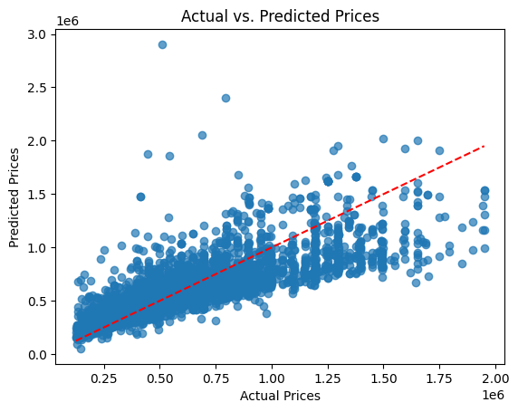
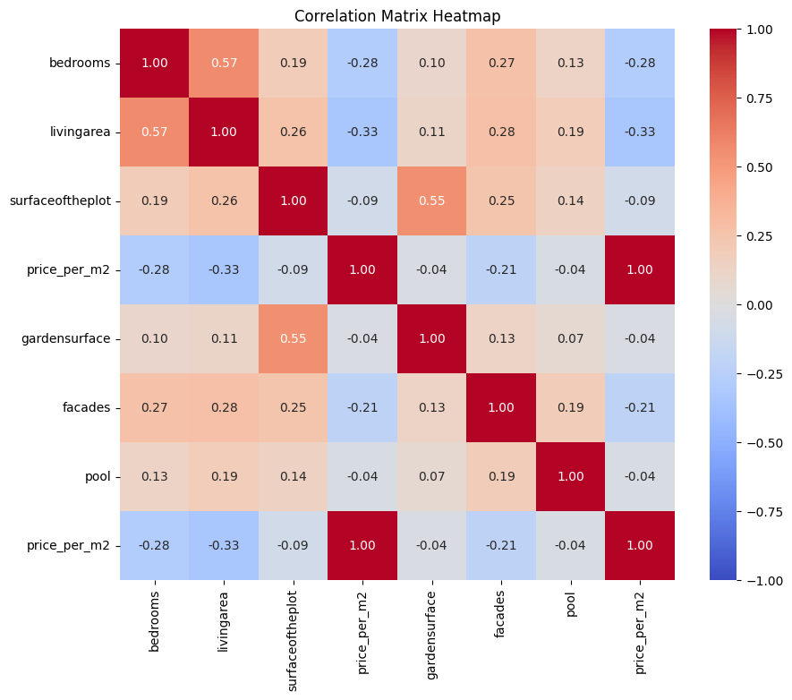

# Immo-Eliza-linear regression model

## Table of Contents

- [Description](#description)
- [Installation](#installation)
- [Usage](#usage)
- [Visuals](#visuals)
- [Contributors](#contributors)
- [Structure](#structure)
- [Timeline](#timeline)

## Description

Creating a machine learning model to predict prices on Belgium's real estate sales.

## Installation

-Clone the repository: `` git clone https://github.com/elsagk/Immo_Eliza_regression.git`

-Install dependencies:
-.Python 3.12.7

-.pip install pandas matplotlib sklearn

      -Version: name-Pandas 2.2.3   Matplotlib 1.16.0   sklearn 1.5.2  sklearn

## Usage

- Retrieve a list of properties from the HTML page source of the website.

- Extract poperties' information from immoweb for each property.

## Visual

## Contributor

https://github.com/elsagk

## Timeline

This stage of the project lasted 6 days in the week of December  09/12/2024 16:00

